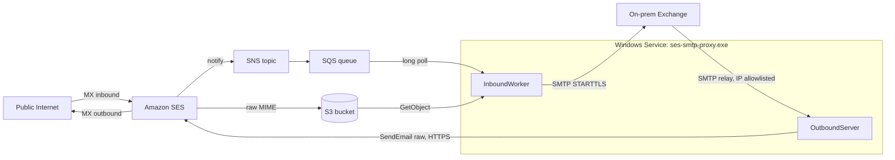

# ses-smtp-proxy

A small Windows service, written in Go, that bridges Amazon SES and an
on-premise Microsoft Exchange server in both directions.

`ses-smtp-proxy` was built for an isolated student IT-contest network that has
outbound internet access but cannot expose its Exchange server to the public
internet. Amazon SES sits at the edge of the public internet; the proxy runs
on the Exchange host inside the isolated network and shuttles messages
between SES and Exchange over private outbound connections only.

- **Single static `.exe`**, no runtime dependencies.
- **Runs as a Windows service**, registered automatically by the installer.
- **YAML configuration on disk** (`C:\ProgramData\ses-smtp-proxy\config.yaml`).
- **Logs to the Windows Event Log** by default, or to a rotated file when
  configured.
- **One-click NSIS installer** that registers the service, opens the
  firewall, and seeds a starter config.
- **CloudFormation template** that provisions the entire AWS side and emits a
  drop-in `config.yaml` as a stack output.

## Table of contents

- [Architecture](#architecture)
- [Deploy the AWS side](#deploy-the-aws-side)
- [Configure DNS](#configure-dns)
- [Install on the Exchange host](#install-on-the-exchange-host)
- [Configure Exchange](#configure-exchange)
- [Configuration reference](#configuration-reference)
- [Operations](#operations)
- [Troubleshooting](#troubleshooting)
- [Development](#development)
- [Security model](#security-model)
- [License](#license)

## Architecture



### Inbound (internet -> Exchange)

1. SES receives email at the MX endpoint for your domain.
2. SES stores the raw MIME message in S3 and publishes a notification to SNS.
3. The notification fans out to an SQS queue.
4. The proxy long-polls SQS, fetches the message from S3, and connects to
   Exchange over SMTP (with STARTTLS) using the original envelope sender and
   recipients.
5. On 2xx the SQS message is deleted. On a transient failure the message
   becomes visible again after the visibility timeout; after `maxReceiveCount`
   redeliveries it lands in a dead-letter queue.

### Outbound (Exchange -> internet)

1. Exchange's Send Connector forwards outbound mail to the proxy's local
   SMTP listener.
2. The proxy verifies the connecting IP against the configured allowlist and
   buffers the message.
3. The MIME payload is sent to SES via `SendEmail` with `Content.Raw`,
   preserving the original envelope.
4. SES delivers to the public internet.

The proxy never accepts inbound connections from the public internet — only
outbound HTTPS to SES/SQS/S3 and the loopback/LAN SMTP listener for Exchange.

## Deploy the AWS side

> **Region note**: SES inbound is available only in certain regions
> (`us-east-1`, `us-east-2`, `us-west-2`, `eu-west-1`, `eu-central-1`,
> `ap-south-1`, `ap-southeast-1`, `ap-southeast-2`, `ap-northeast-1`,
> `ca-central-1`). Pick one of these for the stack.

1. Verify you have the AWS CLI configured with admin-equivalent credentials
   for the target account.
2. Move SES out of the sandbox in the AWS console (Account dashboard ->
   "Request production access"). Required before SES will deliver real mail.
3. Deploy the stack:

   ```sh
   aws cloudformation deploy \
     --template-file cloudformation/template.yaml \
     --stack-name ses-smtp-proxy \
     --region us-east-1 \
     --capabilities CAPABILITY_NAMED_IAM \
     --parameter-overrides \
         DomainName=mail.example.com \
         AlarmEmail=ops@example.com
   ```

4. Retrieve the rendered `config.yaml` directly from the stack output:

   ```sh
   aws cloudformation describe-stacks \
     --stack-name ses-smtp-proxy \
     --region us-east-1 \
     --query "Stacks[0].Outputs[?OutputKey=='ConfigYaml'].OutputValue" \
     --output text > config.yaml
   ```

   The result is a complete configuration file with the queue URL, S3 bucket,
   region, access key, and secret already filled in.

### Resources provisioned

| Resource | Notes |
| --- | --- |
| S3 bucket | Raw inbound emails, SSE-S3, lifecycle-expired after `S3RetentionDays` |
| SNS topic | SES publishes per-receipt notifications |
| SQS queue + DLQ | Subscribed to SNS with raw delivery; redrive after 5 attempts |
| SES domain identity | DKIM signing enabled (tokens emitted as stack outputs) |
| SES receipt rule set + rule | Routes mail for `DomainName` to the S3 + SNS actions |
| Lambda + custom resource | Marks the receipt rule set as active (SES has no native CFN resource for this) |
| IAM user + access key | Least privilege: SQS receive/delete, S3 read, SES send (scoped by `ses:FromAddress`) |
| CloudWatch alarm | Optional DLQ-depth alarm wired to an SNS email subscription |

## Configure DNS

The stack outputs everything you need to add at your DNS provider.

| Record | Source |
| --- | --- |
| MX (priority 10 -> `inbound-smtp.<region>.amazonaws.com`) | `InboundMxRecord` output |
| 3 x DKIM `CNAME` | `DkimCnameRecord1` / `2` / `3` outputs |

```sh
aws cloudformation describe-stacks --stack-name ses-smtp-proxy \
  --query "Stacks[0].Outputs[?starts_with(OutputKey, 'Dkim') || OutputKey=='InboundMxRecord'].[OutputKey,OutputValue]" \
  --output table
```

SES considers the domain verified once the DKIM CNAMEs resolve; this can take
a few minutes after the DNS records propagate. Until verification completes,
SES drops inbound mail and rejects outbound `SendEmail` calls.

## Install on the Exchange host

1. Download the latest installer from the project's [Releases page]; pick the
   architecture that matches your Windows host (typically
   `ses-smtp-proxy-<version>-amd64-setup.exe`).
2. Run the installer as Administrator. Components:
   - **Service binary** (required) — copies the exe, creates
     `C:\ProgramData\ses-smtp-proxy\{logs,tls}`, registers the Windows service
     with auto-start and on-failure restart, and registers an Event Log source.
   - **Sample config.yaml** — seeds a starter config only when none is
     already present (upgrades preserve operator edits).
   - **Windows Firewall: inbound SMTP** — opens TCP/2525 inbound for the
     local SMTP listener.
3. Save the CloudFormation-rendered config from the previous section to
   `C:\ProgramData\ses-smtp-proxy\config.yaml`, overwriting the seeded
   sample.
4. Edit `outbound.allowedCidrs` in the config to include the Exchange Send
   Connector source IP (typically the Exchange server itself).
5. Start the service:

   ```powershell
   sc.exe start ses-smtp-proxy
   ```

   ...or use the Services console (`services.msc`).

Logs land in **Event Viewer -> Windows Logs -> Application** under source
`ses-smtp-proxy` (or in the file configured via `logging.file`).

## Configure Exchange

### Inbound (already done)

No Exchange configuration is needed for inbound mail. The proxy connects to
the Exchange Receive Connector listening on port 25 just like any internal
SMTP client.

### Outbound

Add a **Send Connector** that forwards mail for all external domains (`*`) to
the proxy's local SMTP listener:

| Setting | Value |
| --- | --- |
| Type | Custom |
| Address space | SMTP, `*`, cost 1 |
| Smart host | `127.0.0.1` (or the proxy host) on port `2525` |
| Smart host auth | None |
| Source servers | The Exchange server(s) authorised to relay |

If the proxy and Exchange run on the same host, `127.0.0.1` is the simplest
arrangement and matches the `127.0.0.1/32` entry in the default config.

#### Create the Send Connector with PowerShell

Run the following from the **Exchange Management Shell** as an Exchange
Organization Administrator.

```powershell
New-SendConnector `
    -Name "Outbound via ses-smtp-proxy" `
    -Usage Custom `
    -AddressSpaces "SMTP:*;1" `
    -DNSRoutingEnabled $false `
    -SmartHosts "[127.0.0.1]:2525" `
    -SmartHostAuthMechanism None `
    -SourceTransportServers (Get-TransportService | Select-Object -ExpandProperty Name) `
    -ProtocolLoggingLevel Verbose `
    -Enabled $true
```

#### Verify and tweak

```powershell
# Send a quick test message (replace the addresses).
Send-MailMessage `
    -SmtpServer $env:COMPUTERNAME `
    -From "noreply@$( (Get-AcceptedDomain | Where-Object Default).DomainName )" `
    -To "you@example.com" `
    -Subject "ses-smtp-proxy outbound test" `
    -Body "If this arrived, the Send Connector is working."
```

## Configuration reference

Full annotated sample lives in [`config.example.yaml`](config.example.yaml).
Key fields:

### `aws`

| Field | Default | Notes |
| --- | --- | --- |
| `region` | _required_ | Must match the region the CloudFormation stack was deployed to. |
| `accessKeyId` / `secretAccessKey` | empty | Both empty means use the default credential chain. Both set uses static credentials. |
| `profile` | empty | Optional shared-config profile name. Ignored when static credentials are set. |

### `inbound`

| Field | Default | Notes |
| --- | --- | --- |
| `sqsQueueUrl` | _required_ | Take from the `SqsQueueUrl` stack output. |
| `s3Bucket` | empty | When set, messages referencing any other bucket are rejected as a safety check. |
| `pollWaitSeconds` | `20` | SQS long-poll wait. Max 20. |
| `maxConcurrent` | `4` | Concurrent SMTP relays in flight. |
| `visibilityTimeoutSeconds` | `300` | Should comfortably exceed the worst-case S3 fetch + SMTP relay time. |
| `exchange.host` / `port` | `127.0.0.1:25` | Local Exchange SMTP target. |
| `exchange.starttls` | `true` | Issue STARTTLS after EHLO. |
| `exchange.insecureSkipVerify` | `false` | Set `true` only for self-signed Exchange certs. |
| `exchange.heloDomain` | `ses-smtp-proxy.local` | HELO/EHLO name advertised to Exchange. |
| `exchange.username` / `password` | empty | Optional SMTP AUTH (most internal relays don't need it). |

### `outbound`

| Field | Default | Notes |
| --- | --- | --- |
| `listen` | `0.0.0.0:2525` | Address Exchange's Send Connector relays to. |
| `allowedCidrs` | _required_ | Connection source must match one of these CIDRs; everything else gets `554`. |
| `maxMessageBytes` | `41943040` (40 MiB) | SES inbound cap. |
| `tls.certFile` / `keyFile` | empty | Optional STARTTLS for the Exchange -> proxy hop. Leave empty on a trusted localhost link. |

### `logging`

| Field | Default | Notes |
| --- | --- | --- |
| `level` | `info` | `debug` / `info` / `warn` / `error`. |
| `file` | empty | Empty -> Windows Event Log (source `ses-smtp-proxy`). When set, logs are written here and rotated by size. |
| `maxSizeMB` / `maxBackups` / `maxAgeDays` | `50` / `5` / `30` | Only consulted when `file` is set. |

## Operations

### CLI

```text
ses-smtp-proxy <command> [--config <path>]

  run         Run the service (also invoked by the SCM)
  debug       Run in the foreground with logs on stderr
  install     Register the Windows service
  uninstall   Remove the Windows service registration
  start       Tell the SCM to start the service
  stop        Tell the SCM to stop the service
  restart     Restart the service
  status      Show the service status (running / stopped / unknown)
  version     Print the build version and exit
```

`run` and `debug` differ only in where logs go and how SCM lifecycle is
handled — both invoke the same inbound and outbound workers.

### Inspecting the DLQ

```sh
aws sqs receive-message --queue-url $(aws cloudformation describe-stacks \
  --stack-name ses-smtp-proxy \
  --query "Stacks[0].Outputs[?OutputKey=='DlqUrl'].OutputValue" --output text) \
  --max-number-of-messages 10
```

DLQ messages still reference S3 objects, so you can manually replay or
inspect them.

### Forcing a config reload

The service reads its configuration only at startup. Restart the service
after editing `config.yaml`:

```powershell
sc.exe stop ses-smtp-proxy
sc.exe start ses-smtp-proxy
```

## Troubleshooting

| Symptom | Likely cause |
| --- | --- |
| Service exits immediately after start | `config.yaml` missing or fails validation. Run `ses-smtp-proxy.exe debug` from an Administrator prompt to see the error on stderr. |
| `Source IP not permitted to relay` (554) on outbound | The Exchange Send Connector source isn't covered by `outbound.allowedCidrs`. |
| Inbound mail accepted by SES but never reaches Exchange | Check the DLQ depth. Common causes: Exchange Receive Connector rejecting the proxy (allow it as an internal relay), STARTTLS cert untrusted (set `insecureSkipVerify: true` for testing), Exchange refusing the recipient. |
| `MailFromDomainNotVerifiedException` from SES | DKIM records haven't propagated yet, or the `From` header uses a domain other than the verified one. |
| `Throttling` from SES | You're in the SES sandbox, or hit the per-second sending quota. Request production access and/or raise the quota. |
| Need richer logs | Set `logging.level: debug` and either `logging.file` to a path or use `ses-smtp-proxy.exe debug`. |

## Development

```sh
go vet ./...
go test ./... -race
go build ./cmd/ses-smtp-proxy
```

Cross-compile a Windows binary from any OS:

```sh
GOOS=windows GOARCH=amd64 go build -o ses-smtp-proxy.exe ./cmd/ses-smtp-proxy
```

Build the installer locally (requires `makensis`; on macOS: `brew install nsis`,
on Debian/Ubuntu: `sudo apt-get install nsis`):

```sh
mkdir -p dist
GOOS=windows GOARCH=amd64 go build -o dist/ses-smtp-proxy-amd64.exe ./cmd/ses-smtp-proxy
makensis -DVERSION=dev -DARCH=amd64 \
  -DEXE_PATH=../dist/ses-smtp-proxy-amd64.exe \
  -DOUT_FILE=../dist/ses-smtp-proxy-dev-amd64-setup.exe \
  installer/installer.nsi
```

Validate the CloudFormation template:

```sh
pip install cfn-lint
cfn-lint cloudformation/template.yaml
```

## Security model

- The Windows service runs as `LocalSystem` (the kardianos default) but
  performs no privileged operations beyond binding its configured SMTP port.
  You can `sc config ses-smtp-proxy obj= "NT SERVICE\ses-smtp-proxy"` or a
  dedicated service account if your policy requires it.
- AWS credentials live only in `C:\ProgramData\ses-smtp-proxy\config.yaml`,
  which is ACL'd to administrators by default. Treat the file as sensitive.
- The IAM policy attached to the service user is least-privilege: it cannot
  modify the queue or bucket, cannot create new IAM resources, and can only
  send mail with a `From:` address inside the verified domain.
- The local SMTP listener accepts traffic only from IPs/CIDRs you explicitly
  allowlist. There is no SMTP AUTH; the trust boundary is the LAN.
- Inbound SES -> Exchange traffic flows over outbound HTTPS to AWS and a
  local SMTP connection to Exchange. The Exchange host never accepts
  inbound traffic from the public internet.

## License

[MIT](LICENSE).

[Releases page]: https://github.com/TCANationals/ses-to-smtp-proxy/releases
